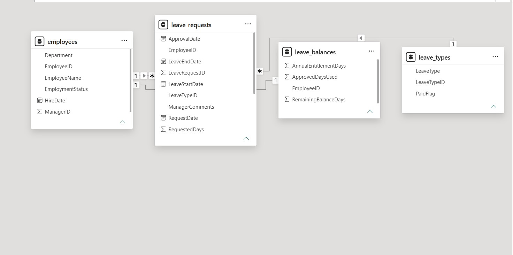
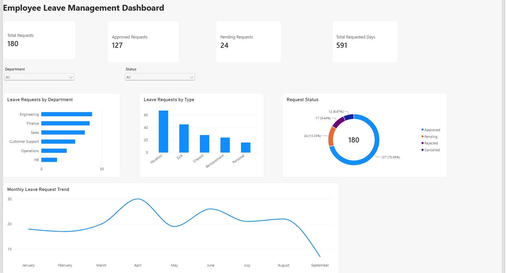

# Power BI Dashboard

## Objective

Extend the Employee Leave Management case study into a simple interactive management view using the same synthetic dataset used for SQL analysis.

The report answers practical questions such as:

- How many leave requests have been submitted?
- How many are Approved or Pending?
- Which departments generate the most leave activity?
- Which leave types are used most often?
- How does request volume change by month?

## Data Model

The Power BI model uses four tables:

- **Employees** - employee master data
- **LeaveRequests** - leave-request transactions
- **LeaveTypes** - leave-type reference data
- **LeaveBalances** - employee leave balances

Relationships used in the model:

| From | To | Cardinality |
|---|---|---|
| Employees[EmployeeID] | LeaveRequests[EmployeeID] | 1 : many |
| LeaveTypes[LeaveTypeID] | LeaveRequests[LeaveTypeID] | 1 : many |
| Employees[EmployeeID] | LeaveBalances[EmployeeID] | 1 : 1 |

### Actual Power BI Model



## DAX Measures

Four straightforward measures support the report:

```DAX
Total Requests =
COUNTROWS(LeaveRequests)

Approved Requests =
CALCULATE(
    [Total Requests],
    LeaveRequests[Status] = "Approved"
)

Pending Requests =
CALCULATE(
    [Total Requests],
    LeaveRequests[Status] = "Pending"
)

Total Requested Days =
SUM(LeaveRequests[RequestedDays])
```

The measures are intentionally simple and focused on the business questions being analysed.

## Dashboard

The report includes:

- KPI cards for Total Requests, Approved Requests, Pending Requests and Total Requested Days
- Leave Requests by Department
- Leave Requests by Type
- Request Status
- Monthly Leave Request Trend
- Department and Status dropdown slicers

### Actual Power BI Dashboard



For the current synthetic dataset, the report shows:

- **Total Requests:** 180
- **Approved Requests:** 127
- **Pending Requests:** 24
- **Total Requested Days:** 591

## What This Demonstrates

This Power BI work connects:

**Business question -> data model -> DAX measure -> visual -> interpretation**

The objective is to demonstrate practical data analysis and reporting capability relevant to Business Analyst and Business Systems Analyst work, rather than advanced BI development.

## Case Study Note

The report was built in Power BI Desktop using the same synthetic Employee Leave Management data used for the SQL analysis. The screenshots above show the actual report page and data model created for this portfolio case study.
