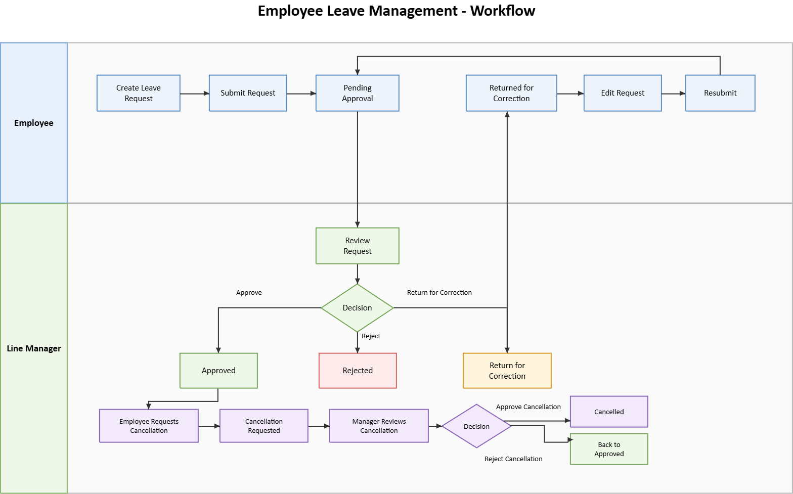

# Employee Leave Management - Business Analysis, SQL, Power BI & QA Case Study

## Overview

This independent portfolio case study demonstrates how I approach an enterprise workflow from business-rule understanding and risk analysis through practical SQL investigation, Power BI reporting, test design and release assessment.

The focus is on the highest-risk areas of an Employee Leave Management Portal, including leave balance accuracy, approvals, authorization, state transitions, and cancellation handling.

## Skills Demonstrated

- Business & Functional Analysis
- SQL Data Analysis
- Power BI Data Modelling & Dashboard Design
- Functional & End-to-End Testing
- Test Strategy & Risk-Based Test Planning
- Test Scenario & Test Case Design
- Negative & Boundary Value Testing
- State Transition Testing
- Role-Based Access & Authorization Validation
- Leave Balance & Data Integrity Validation
- Smoke, Sanity & Regression Testing
- Business Rule Validation
- Defect & Release Risk Assessment

## Key Artifacts

- [Project Overview](01-project-overview/PROJECT_OVERVIEW.md)
- [Business Rules](02-business-rules/BUSINESS_RULES.md)
- [Test Strategy](03-test-strategy/TEST_STRATEGY.md)
- [Risk Assessment](04-risk-assessment/RISK_ASSESSMENT.md)
- [Role & Permission Matrix](05-roles-and-permissions/ROLE_PERMISSION_MATRIX.md)
- [State Transition Matrix](06-state-transitions/STATE_TRANSITION_MATRIX.md)
- [Workflow Test Cases](07-test-cases/WORKFLOW_TEST_CASES.md)
- [Leave Balance Test Cases](07-test-cases/LEAVE_BALANCE_TEST_CASES.md)
- [Authorization Test Cases](07-test-cases/AUTHORIZATION_TEST_CASES.md)
- [Test Execution Approach](08-test-execution/TEST_EXECUTION_APPROACH.md)
- [Test Summary & Release Recommendation](10-test-summary/TEST_SUMMARY.md)
- [SQL Analysis & Business Questions](11-data-analysis/SQL_ANALYSIS.md)
- [Practical SQL Queries](11-data-analysis/leave_analysis.sql)
- [Power BI Dashboard Design, Measures & Data-Driven Preview](12-power-bi/POWER_BI_DASHBOARD.md)
- [Analysis Dataset](data/)

## Data Analysis & Reporting

The project uses four related synthetic datasets: Employees, LeaveRequests, LeaveTypes and LeaveBalances. SQL is used to investigate request status, department activity, pending requests, leave types, balances, monthly trends and business-rule/data-quality exceptions.

The same model is used for the Power BI extension, with KPI cards, department and leave-type analysis, status distribution, monthly trends and interactive slicers. The Power BI documentation includes the intended relationships and DAX measures. A data-driven dashboard preview is included using the same synthetic dataset. It is clearly identified as a portfolio preview; actual Power BI Desktop screenshots can be added after the native report is rebuilt.

## Test Focus

Testing is intentionally risk-based.

Deeper coverage is applied to:

- Leave request submission
- Leave balance calculation
- Approval and rejection
- Employee self-approval prevention
- Role-based access
- Cancellation and balance restoration
- Critical status transitions
- Duplicate processing prevention

Other leave types are covered with representative scenarios rather than exhaustive testing.

## Workflow

The core workflow covers:

Employee Request → Manager Review → Approve / Reject / Return for Correction → Resubmit → Cancellation where applicable.

## Workflow Diagram

## Case Study Note

This is an independent portfolio case study created to demonstrate practical Business Analysis, SQL/data analysis, Power BI and Quality Assurance thinking.

Business rules are simplified for the case study and do not represent the complete HR policy of any specific organization.
