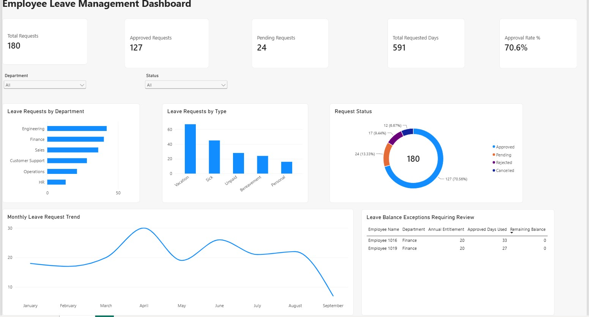

# Employee Leave Management | Business Analysis, SQL & Power BI

> Independent portfolio case study using synthetic data.

## Business Problem

Managers and HR need clear visibility into employee leave requests, approval status, leave balances and usage patterns. This case study shows how I translated that need into concise functional requirements and business rules, investigated the data with SQL, and built a Power BI dashboard for management reporting.

## What I Did

- Defined the core stakeholders, functional requirements, business rules and scope.
- Used SQL to answer practical business questions, validate data and investigate exceptions.
- Built a four-table Power BI data model and simple DAX measures.
- Created an interactive dashboard to analyze requests by status, department, leave type and month.
- Interpreted the results as business insights rather than treating SQL and Power BI as standalone technical exercises.

## Skills Demonstrated

**Business Analysis:** Requirements Analysis, Functional Requirements, Business Rules, Stakeholder Needs, Scope Definition  
**Data Analysis:** SQL, Data Validation, Business-Rule / Exception Analysis  
**Reporting:** Power BI, Data Modelling, DAX Measures, Dashboarding, Business Insights

## Key Artifacts

- [Requirements & Business Rules](business-analysis/REQUIREMENTS_AND_RULES.md)
- [SQL Analysis](sql/SQL_ANALYSIS.md)
- [SQL Queries](sql/leave_analysis.sql)
- [Power BI Dashboard & Data Model](power-bi/POWER_BI_DASHBOARD.md)
- [Synthetic Dataset](data/)

## Power BI Dashboard

The report contains five headline management metrics:

- **Total Requests:** 180
- **Approved Requests:** 127
- **Pending Requests:** 24
- **Total Requested Days:** 591
- **Approval Rate:** 70.6%

It also provides analysis by department, leave type, request status and month, with Department and Status slicers, plus a focused table of leave-balance exceptions requiring review.

## Key Business Insights

- **Approved requests dominate the workflow:** 127 of 180 requests are Approved, while 24 remain Pending, giving managers a clear follow-up population.
- **Engineering and Finance show the highest request activity:** 42 and 40 requests respectively, compared with 13 in HR. This indicates where leave activity is concentrated, not necessarily higher absence rates because department sizes differ.
- **Vacation is the most frequently requested leave type:** 67 requests, followed by Sick leave with 45.
- **April has the highest request volume in the sample:** 30 requests. The monthly trend can help managers identify periods that may require closer capacity planning.
- **Approval Rate is 70.6%:** this describes the proportion of requests approved, but it is not labelled good or bad because the case study does not define a target or benchmark.
- **Two leave-balance records require review:** Employees 1016 and 1019 show approved usage above annual entitlement. They are flagged for investigation rather than automatically treated as errors, because a BA should first confirm the relevant business rule and data context.

## Data Model

The Power BI model uses:

- **Employees** - employee master data
- **LeaveRequests** - leave transactions
- **LeaveTypes** - leave-type reference data
- **LeaveBalances** - employee leave balances

## Tools

**SQLite / SQL | Power BI Desktop | DAX | GitHub**

## Scope Note

This is an independent case study, not client or employer work. The data is synthetic and the requirements and business rules are simplified for demonstration purposes. The objective is to demonstrate practical Business Analysis, SQL and Power BI capability relevant to Business Analyst and Business Systems Analyst roles.
